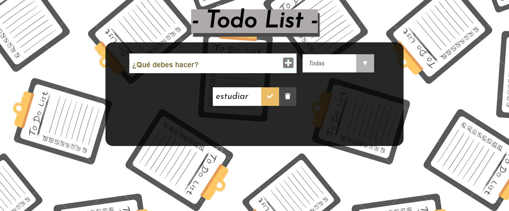

# **TODO LIST de Silvina Bordon** 📝
 
Esta aplicación de React nos permite hacer una lista de tareas, marcar las tareas completadas ✔️ y poder eliminar 🗑 aquellas que ya no quieras o necesites. 

#### Si quieres utilizarlo puedes hacer click en este [enlace](https://silbordon.github.io/proyectToDoList/).

***

 

 ### 📎**Este proyecto requiere las siguientes dependencias**

- 📂[ReactJs](https://es.reactjs.org/).
- 📂[Firebase](https://firebase.google.com/).

 

#### *De Silvi con ❤*
